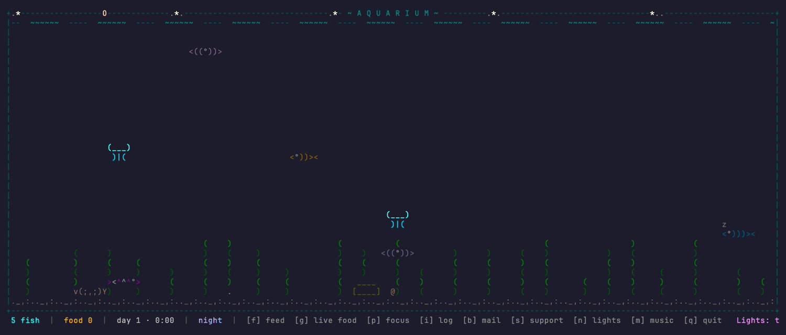
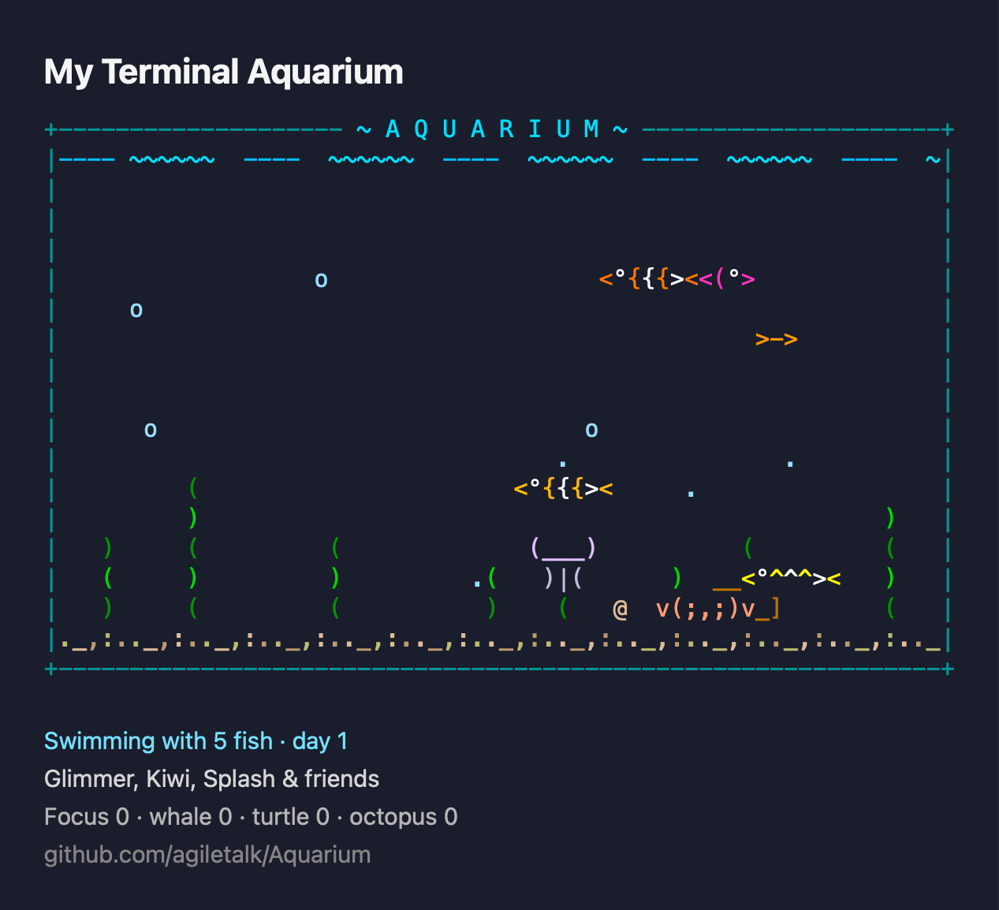

# Aquarium

**English** | [한국어](README.ko.md)

A tiny healing aquarium in your terminal. ASCII tropical fish swim around, bubbles rise, and over time baby fish are born.



## Install

### Homebrew (recommended)

```sh
brew install agiletalk/tap/aquarium
aquarium
```

### Prebuilt binary (no Swift required, macOS only)

Universal binary for both Apple Silicon and Intel Macs:

```sh
curl -L https://github.com/agiletalk/Aquarium/releases/latest/download/aquarium.tar.gz | tar xz
./aquarium
```

### Build from source (Swift 5.9+)

```sh
swift run -c release
```

## Controls

| Key | Action |
|-----|--------|
| `f` | Sprinkle food — the fish come rushing |
| `g` | Release live food (brine shrimp) — cue the chase scene |
| `p` | Start/cancel a 25-minute pomodoro — finish and the fish get a feast |
| `i` | Tank log — every fish's name, age, meals, and visitor sightings |
| `n` | Lights — cycle auto → night → day |
| `m` | Music on/off — a DOS-era chiptune playlist for lo-fi coding |
| Mouse click | Pet a fish — it bloops and darts away |
| `q` / `Ctrl-C` | Quit (tank auto-saves) |

## Pomodoro focus mode (`--focus`)

Your fish become your focus buddies:

```sh
aquarium --focus 25   # minutes (default 25)
```

A countdown appears in the status bar. When the session completes, a feast rains
down for the fish, a chime plays, and the session is recorded in your tank log —
your focus literally grows the tank.

## Share your tank (`--card`)

Render your actual tank — your fish, their names, your records — into a PNG
card ready for Slack or social media:

```sh
aquarium --card   # writes ./aquarium-card.png (+ color preview in terminal)
```



## One-line summary (`--status`)

Check on your tank without opening it:

```sh
$ aquarium --status
><> 12 fish · day 7 · next birth in 2m
```

Put your tank in the tmux status bar via `~/.tmux.conf`:

```
set -g status-right '#(aquarium --status)'
set -g status-interval 60
```

`--help` and `--version` are also supported.

## Language

The UI follows your locale automatically (Korean/English). Force it with:

```sh
AQUARIUM_LANG=ko aquarium   # or en
```

## Things to watch for

- Every fish has its own species and color — including striped tropicals (`><|||°>`).
- Bubbles rise from the weeds and fish mouths, growing as they near the surface (`.` → `o` → `O`).
- A baby fish (`><>`) is born every 15–25 minutes and grows into an adult. Feeding (and finished focus sessions) speeds this up; tank capacity scales with your terminal size, up to 40 fish. When it's full, the app says so honestly.
- The treasure chest `[____]` pops open now and then, glittering gold and startling nearby fish.
- A jellyfish `(___)` pulses along — jetting up as it contracts, sinking as it relaxes.
- **There's a soundtrack.** Press `m` for an eight-track chiptune playlist — "Underwater Stroll", "Moonlit Tank", "Coral Reef Waltz", "Shrimp March", "Deep Sea Dive", "Treasure Chest Polka", "Jellyfish Dream", "Song of the Whale" — synthesized live from square and triangle waves, no audio files needed.
- **Live prey.** Brine shrimp released with `g` wiggle and actively flee from fish; fish prefer them over sinking pellets. Eating one is extra nutritious. Survivors hide in the sand after 50 seconds.
- **Every fish has a name.** Bubbles, Splash, Finn… assigned at birth. Check ages and meal counts in the `i` log. Click one and it runs away as you call its name.
- **Rare visitors.** A whale passes in the distance, a sea turtle drops by, an octopus squirts ink and vanishes. Sightings are recorded in the log. (Impatient? Run `AQUARIUM_VISITOR=whale aquarium` for frequent visits.)
- **A cleanup crew.** The snail `@` slowly crawls to sunken food and eats it; the crab `v(;,;)v` scuttles sideways and occasionally waves its claws. They work the night shift, too.
- **Your tank persists.** State is saved to `~/.aquarium.json` on quit and restored on the next run — including fish born while you were away.
- **At night** the tank dims, stars and a moon appear on the rim, fish doze near the bottom (`z`), and the jellyfish glows teal. Night kicks in automatically from 7pm to 7am or when your terminal/system uses a dark theme — or toggle with `n`.
